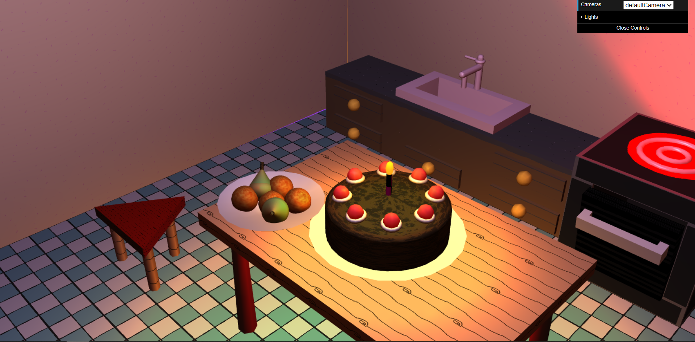

# SGI 2022/2023

## Group T02G07
| Name             | Number    | E-Mail               |
| ---------------- | --------- | ------------------   |
| Duarte Sardão    | 201905497 | up201905497@fe.up.pt |
| Tomás Torres     | 201800700 | up201800700@fe.up.pt |

----

## Projects

### [TP1 - Scene Graph](tp1)

- Everything in specifications done (graph, transformations, textures, lights, cameras, materials, interface)
- Scene with varied elements to show the implementation of the specifications
- We also did turned MyRectangle into a grid of rectangles, so lighting effects (specifically spotlights) would be clearly visible.
- Scene
  - The scene is composed of a tiled area, with a counter with a sink, oven, a table with a bowl/plate with fruits and a plate with a cake and a triangular stool.
  - [Scene screenshots](tp1/scenes/screenshots)

  
  - [Scene](/tp1/scenes/kitchen.xml)

-----

### [TP2 - Nurbs, Animation, Shaders](tp2)
- Features well implemented: NURBS, animations and shaders
- Scene with varied elements to show the implementation of the specifications
- Variable use of NURBS to create criative objects like the chicken and the sink/table corners 
- Scene
  - In addition to what had in TP1, the scene also have a raw chicken on a plate and a shelf with a salt shaker. With animation, we temper the raw chicken with salt, after that we open the oven door, put the chicken inside, turn on the oven and, after the temporizer's time is over, the door open showing a cooked chicken with some smoke effect. At the same time, the faucet is open filling the sink with water and the cake candle shinies. 
  - [Todas as screenshots da TP2](tp2/scenes/screenshots)
  - [Scene](tp2/scenes/kitchen.xml)
  

----

### [TP3 - Checkers](tp3)

- Board feature implemented, with all functionalities (including optional ones).
- Very flexible board definition on XML, allowing to define size of board and components, materials for pieces, sprite for UI, position of board elements like buttons and captures (captures being optional), position of moving camera views, time for turns, spotlight used..
- Variable scenes displaying some of the varied functionality and flexibility of board definition.

- Due to this flexibility, board setup from scratch can be quite laborious.